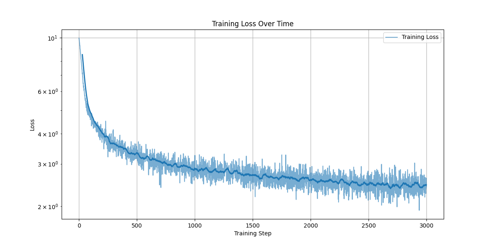
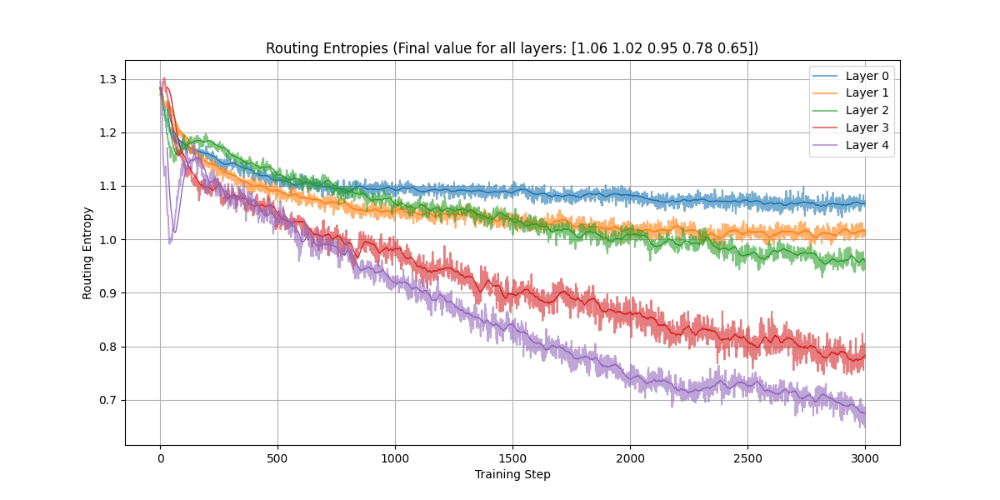
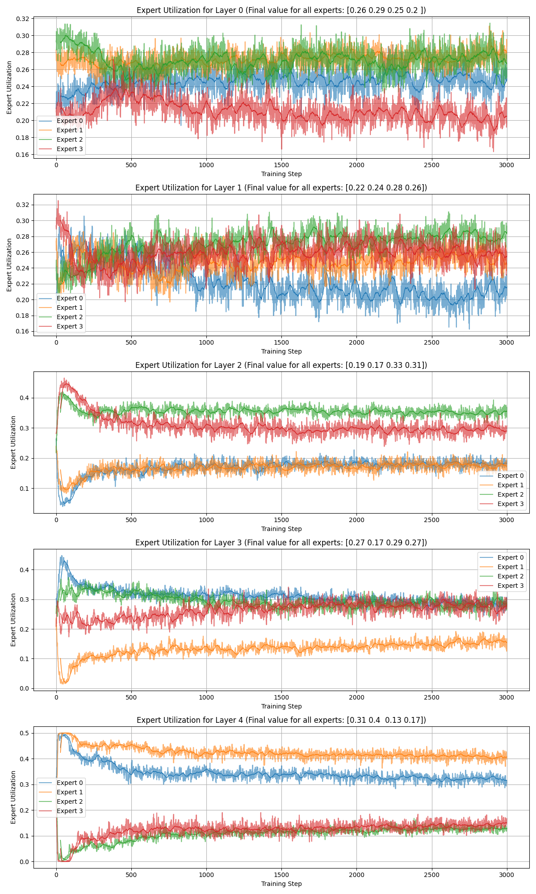

# 🧠 MoE Experiments – Mixture of Experts Transformer in PyTorch  
*This project explores the **Mixture of Experts (MoE) Transformer** for text-completion task, focusing on how different routing strategies (**top‑1, top‑2, random**) affect **expert utilization, routing entropy, and model performance**. While MoE architectures are widely used in large‑scale LLMs, here we build a **small‑scale LLM** to provide hands‑on understanding of **expert specialization and routing dynamics**.*  

This repository is inspired by [FareedKhan-dev/train-llama4](https://github.com/FareedKhan-dev/train-llama4).

[](LICENSE)
[]()
[]()

---

## 🚀 Quick Start

### 🔧 Installation
```bash
# Create and activate a new conda environment (Python 3.10+ recommended)
conda create -n <env-name> python=3.10
conda activate <env-name>

# Clone the repo and install dependencies
git clone git@github.com:tsh-03/moe-experiments.git
cd moe-experiments
pip install .
```

### 🔬 Running the Notebooks
After installation, you can:

#### ▶️ Run the Training Notebook
Open and execute [`moe-transformer.ipynb`](moe-transformer.ipynb) to:
- Train the Mixture of Experts Transformer.
- Visualize training loss, and text generation.

#### 📊 Analyze the Trained Model
Once training is complete, open [`moe-analyze.ipynb`](moe-analyze.ipynb) to:
- Explore routing entropy across layers.
- Evaluate expert utilization balance.
- Inspect model performance and behavior.

---

## 📂 Repository Contents

| File / Folder         | Description |
|-----------------------|-------------|
| **model.py**          | Defines the MoE Transformer architecture, router, experts, and all model logic |
| **prepare_data.py**   | Data utilities (character‑level & tiktoken tokenizers, dataset classes for *Alice in Wonderland* and *TinyStories*) |
| **train.py**          | Training loop, loss computation, top‑k accuracy, logging of routing entropy & expert utilization |
| **utils.py**          | Helper functions for saving/loading models and other utilities |
| **moe-transformer.ipynb** | Notebook for training the MoE Transformer & visualizing training curves |
| **moe-analyze.ipynb** | Notebook for analyzing routing entropy, expert utilization, and performance |
| **saved_models/**     | Directory for trained checkpoints |
| **LICENSE**           | MIT License |
| **README.md**         | This file |

---

## 🔬 Theory & Components

### 🧠 Mixture of Experts (MoE)

**Mixture of Experts (MoE)** is a way to make neural networks larger and smarter without making them much slower.  
A **router** decides which small networks (called "experts") should handle each token. Instead of all experts working on every token, only a few are used each time.

- This lets the model **have more total parameters but similar speed per token**  
- It also helps experts **specialize in different tasks**, which is why MoE is popular in large language models


### 📊 Metrics to Analyze MoE Behavior

#### 🔀 Routing Entropy
Routing entropy measures how confident the router is when choosing experts for each token.

- **Low entropy:** Router is confident (may be overconfident)  
- **High entropy:** Router is uncertain  

For each token $i$, the entropy $H_i$ is calculated using the probabilities $p_{i,j}$ assigned to each expert $j$ (out of $E$ experts):

$$ H_i = -\sum_{j=1}^{E} p_{i,j} \times \log(p_{i,j} + \epsilon) $$

Here, $\epsilon$ is a small number to avoid taking log of zero.

The overall routing entropy $H$ is the average entropy across all $N$ tokens:

$$ H = \frac{1}{N} \sum_{i=1}^N H_i $$

#### 📦 Expert Utilization  
Measures how evenly tokens are distributed among experts.

- **Low std dev:** Experts are used almost equally  
- **High std dev:** Some experts dominate, others get fewer tokens  

Utilization of expert $i$ is defined as:

$$ \text{Utilization}_i = \frac{\text{tokens routed to expert } i}{\text{total tokens}} $$


### 📜 TinyStories Dataset  
This project trains the MoE Transformer model using the [TinyStories](https://huggingface.co/datasets/roneneldan/TinyStories) dataset. TinyStories is a collection of **short, simple stories** ideal for **language modeling research**. Its **small size & diverse vocabulary** make it perfect for **rapid MoE prototyping and analysis**.

---

### 🧪 Experiment Setup

This project compares different routing strategies to understand their impact on expert utilization, routing confidence, and overall model performance.

- **Top-1 Routing:** Each token is assigned to its single most likely expert. This is the standard approach but can lead to uneven expert usage.
- **Top-2 Routing:** Each token is routed to the two most likely experts. This helps smooth gradients and improves the balance of expert utilization, though it requires more computation.
- **Random Routing:** Experts are selected randomly (either one or two per token) as a baseline sanity check to see if learned routing actually provides an advantage.

| # Experts | Routing Type   | Notes                                                     |
|-----------|---------------|-----------------------------------------------------------|
| 4         | Top‑1         | Standard gating; each token routed to its top expert      |
| 4         | Top‑2         | Each token routed to two experts → smoother gradients and better utilization |
| 4         | Top‑1 Random  | Randomly selects one expert per token → sanity check     |
| 4         | Top‑2 Random  | Randomly selects two experts per token → sanity check    |

---

### 📈 Results

### 📝 Generated Text  
**Prompt:** `Once upon a time`  

**Generated Text:**  
> Once upon a time, there was a little girl named Lily. She loved to play and eat carrots. One day, she  
found some her friend named Sue. Sue was very weak and always discussed to her aunt with her favorite basketball.  
>  
> Lily ran to his friend, Tommy, came over to sandwiches. Sue was good at Max

### 📉 Loss, Routing Entropy, and Expert Utilization during training
Below plots show the evolution of loss, routing entropy, and expert utilization during training for Top-2 routing
- **Loss vs Training Step:**  
  

- **Routing Entropy vs Training Step:**  
  

- **Expert Utilization vs Training Step:**  
  

**Key Observations:**  
- Routing entropy decreases during training, showing the router becomes more confident.  
- Early layers have higher entropy (more uncertainty); later layers are more confident (lower entropy).  
- Expert utilization is balanced in lower layers but uneven in deeper layers.  
- After ~500 steps, loss and utilization stabilize, but entropy keeps decreasing because top-k experts are selected deterministically. Adding a routing entropy penalty could encourage better expert balance and improve performance.

---

### 🔥 Results

| Model           | Test Loss | Top‑3 Accuracy | Routing Entropy (5 layers)             | Expert Utilization Std Dev (5 layers) |
|-----------------|-----------|----------------|----------------------------------------|--------------------------------|
| Top‑1           | 2.46      | 66.79%         | Low [1.11 1.08 1.06 0.94 0.78]        | High [0.02 0.11 0.12 0.11 0.09] |
| Top‑1 Random    | 2.53      | 65.57%         | High [1.27 1.27 1.27 1.27 1.27]       | Even [0.01 0.01 0.01 0.01 0.01] |
| Top‑2           | 2.42      | 67.22%         | Low [1.06 1.02 0.95 0.78 0.65]        | High [0.03 0.02 0.07 0.05 0.11] |
| Top‑2 Random    | 2.53      | 65.63%         | High [1.27 1.27 1.27 1.27 1.27]       | Even [0.01 0.01 0.01 0.01 0.01] |

🔹 Top‑k routing outperforms random routing  
🔹 Top‑2 routing performs best (lower loss, higher accuracy)  
🔹 Random routing works surprisingly well → task may be too simple for full expert specialization.

---
